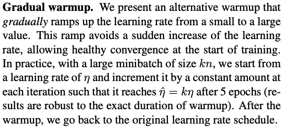
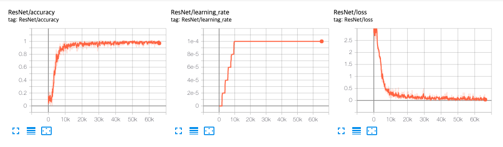

[TensorFlow 2] Accurate, Large Minibatch SGD: Training ImageNet in 1 Hour
=====

## Related Repositories
<a href="https://github.com/YeongHyeon/ResNet-TF2">ResNet-TF2</a>  
<a href="https://github.com/YeongHyeon/ResNeXt-TF2">ResNeXt-TF2</a>  
<a href="https://github.com/YeongHyeon/WideResNet_WRN-TF2">WideResNet(WRN)-TF2</a>  
<a href="https://github.com/YeongHyeon/ResNet-with-SGDR-TF2">ResNet-with-SGDR-TF2</a>

## Concept
<div align="center">
    
  <p>Learning Rate Warm-Up strategy [1].</p>
</div>

## Training
<div align="center">
    
  <p>Accuracy, Loss, and Learning Rate graph in training procedure.</p>
</div>

## Performance

|Indicator|Value|
|:---|:---:|
|Accuracy|0.98570|
|Precision|0.98572|
|Recall|0.98561|
|F1-Score|0.98564|

```
Confusion Matrix
[[ 972    0    1    0    0    0    3    2    2    0]
 [   0 1123    3    2    3    1    0    0    3    0]
 [   2    2 1021    1    1    0    0    1    3    1]
 [   0    0    0 1003    0    3    0    1    3    0]
 [   0    0    1    0  973    0    0    0    2    6]
 [   2    0    0    7    0  873    2    0    4    4]
 [   4    1    0    1    1    2  943    0    6    0]
 [   0    4    6    4    1    0    0 1006    2    5]
 [   3    0    3    2    0    0    0    1  962    3]
 [   3    2    0    5    7    2    0    3    6  981]]
Class-0 | Precision: 0.98580, Recall: 0.99184, F1-Score: 0.98881
Class-1 | Precision: 0.99205, Recall: 0.98943, F1-Score: 0.99074
Class-2 | Precision: 0.98647, Recall: 0.98934, F1-Score: 0.98791
Class-3 | Precision: 0.97854, Recall: 0.99307, F1-Score: 0.98575
Class-4 | Precision: 0.98682, Recall: 0.99084, F1-Score: 0.98882
Class-5 | Precision: 0.99092, Recall: 0.97870, F1-Score: 0.98477
Class-6 | Precision: 0.99473, Recall: 0.98434, F1-Score: 0.98951
Class-7 | Precision: 0.99211, Recall: 0.97860, F1-Score: 0.98531
Class-8 | Precision: 0.96878, Recall: 0.98768, F1-Score: 0.97814
Class-9 | Precision: 0.98100, Recall: 0.97225, F1-Score: 0.97661

Total | Accuracy: 0.98570, Precision: 0.98572, Recall: 0.98561, F1-Score: 0.98564
```

## Requirements
* Python 3.7.6  
* Tensorflow 2.1.0  
* Numpy 1.18.1  
* Matplotlib 3.1.3  

## Reference
[1] Priya Goyal et al. (2017). <a href="https://arxiv.org/abs/1706.02677">Accurate, Large Minibatch SGD: Training ImageNet in 1 Hour</a>. arXiv preprint arXiv:1706.02677.
